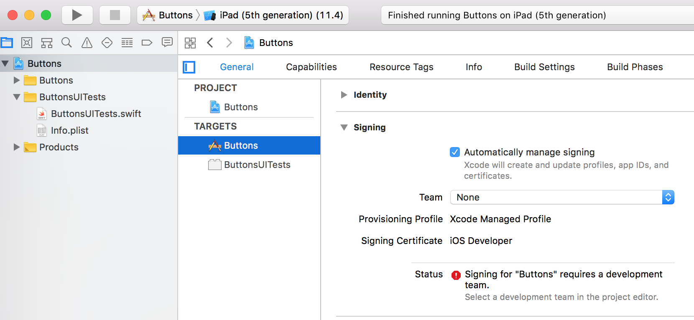

# Buttons iOS app and XCUITest

This sample iOS App and XCUITest includes an Xcode project for an app and XCUITest written using Swift. It has a shell script for submitting the tests to App Center Test. This sample does not require any App Center specific extensions.

Primary documentation for App Center Test is available at [App Center Test documentation](https://docs.microsoft.com/en-us/appcenter/test-cloud/).

Primary documentation for XCUITest in App Center Test is available at [Preparing XCUITest Tests for Upload](https://docs.microsoft.com/en-us/appcenter/test-cloud/preparing-for-upload/xcuitest).
(Note: this documentation may still reference the AppCenter XCUITest Extensions. They are *newly* no longer required and this sample illustrates how to create and submit tests without those extensions.)

Clone or download this repository so you can work with it locally.

## Setting a signing identity

Before you can run the app or XCUITest locally on a physical device or in App Center Test (which also uses physical devices) you'll need to select an Apple Signing Identiy.

1. Open this project in Xcode.  
2. Navigate to the `Buttons` Target with Project navigator icon>`Buttons`>Hide/show project targets>`Buttons` Target.  
3. Select a Team for signing.
4. Do the same for the `ButtonsUITests` target.  

## Building & running locally

1. Open this project in Xcode.  
2. Run the tests locally with Xcode>Product>Test (or CMD+U).  

## Uploading app & tests

1. Create an account and setup your local environment. See [Getting started with App Center Test](https://docs.microsoft.com/en-us/appcenter/test-cloud/getting-started).  
2. Generate a command line for upload for an iOS App using the XCUITest framework. This app and XCUITest require iOS 9.x or greater, so specify at least one device that is iOS 9.x or greater.
See [Starting A Test Run](https://docs.microsoft.com/en-us/appcenter/test-cloud/starting-a-test-run).  
3. Using the `--app name` and `--devices slug` from that generated command line, modify the file `XCUITest/Buttons/app-submit.sh` to include your `app_name` and `devices_slug`.  
4. Run the command (from the folder `XCUItest/Buttons/`): `sh app-submit.sh`  

## Test details

If you submit the tests to App Center Test and view the Test Report you will be able to see one test step and one screenshot for the test `testNoActivities` and there are three screenshots and test steps for the test `testActivities`. This is a result of how the tests are written. You can compare the source code for these two tests in `ButtonsUITests.swift`.

In `testActivities` the test steps are wrapped in `XCTContext.runActivity` and in `testNoActivities` they are not. To generate screenshots and test steps wrap your test steps or sub tests in `XCTContext.runActivity`. By default, screenshots are generated automatically at the end of each `Activity`. The test `testActivities` also demonstrates the use of a utility function `screenshot` to take a screenshot at a specific point within an `Activity` instead of at the end.

For more information, see [Grouping Tests into Substeps with Activities](https://developer.apple.com/documentation/xctest/activities_and_attachments/grouping_tests_into_substeps_with_activities).

## Simulator bug

If you are running locally on a simulator there is an issue that prevents XCUITest from starting or results in a crash of XCUITest when tapping a button with certain iOS Simulator versions. Because of this bug, avoid iOS Simulator versions 9.0, 11.0.1, 11.1, and 11.2; see: [Bug Report 39348762: XCUITest crashes in -[XCElementSnapshot(Hitpoint) hitPoint:] with EXC_BAD_ACCESS ](https://github.com/lionheart/openradar-mirror/issues/19677). This is a simulator only issue. It does not impact running on physical devices and does not cause any problems with App Center Test.  
